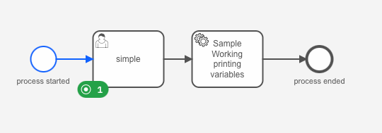
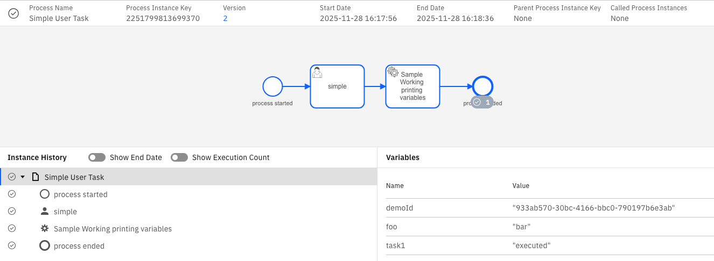

# Simple Tasklist Search Application

## Usage of the [Community Client](https://github.com/camunda-community-hub/camunda-tasklist-client-java)


```xml
<dependency>
    <groupId>io.camunda</groupId>
    <artifactId>spring-boot-starter-camunda-sdk</artifactId>
    <version>8.7.19</version>
</dependency>
```

How to filter with the Camunda Search Query API to find tasks by variable:
```java
private final CamundaTaskListClient taskListClient;
    public List<Task> search(String searchString) throws TaskListException {
        // Building the search query as in the documention
        TaskSearchRequest request = new TaskSearchRequest()
                .state(TaskSearchRequest.StateEnum.CREATED)
                .taskVariables(Arrays.asList(
                        new TaskByVariables()
                        .name("demoId") // process instance variable set at the beginning
                        .operator(TaskByVariables.OperatorEnum.EQ)
                        .value(String.format("\"%s\"", searchString)))
                );
        log.info("search for variables with value: {}", request.toString());
        return taskListClient.getTasks(request, false);
    }
```

`taskListClient.getTasks(request, true)` will return also the variables which were in the scope.

## Usage of the JobWorker Example with the [Camunda SDK](https://docs.camunda.io/docs/8.7/apis-tools/spring-zeebe-sdk/getting-started/) 

```xml
<dependency>
    <groupId>io.camunda</groupId>
    <artifactId>spring-boot-starter-camunda-tasklist</artifactId>
    <version>8.7.4</version>
</dependency>
```

## How to test it locally 

On Start a bpmn diagram will be deployed and the process will be started with a demoId variable.

```
started process instance with id: [2251799813700132] and with id [9bf621d6-889e-4ad3-b5b8-79f39bd2fd2e]
```

The Id `9bf621d6-889e-4ad3-b5b8-79f39bd2fd2e` can be used to search as an example:

```shell
curl http://localhost:8091/api/sample/get-tasks/9bf621d6-889e-4ad3-b5b8-79f39bd2fd2e
```

This will return a list of task back

```json
[
  {
    "id": "2251799813700138",
    "name": "simple",
    "processName": "Simple User Task",
    "processDefinitionKey": "2251799813691352",
    "processInstanceKey": "2251799813700132",
    "assignee": null,
    "creationDate": "2025-11-28T15:24:06.481+0000",
    "completionDate": null,
    "taskState": "CREATED",
    "candidateUsers": null,
    "candidateGroups": null,
    "followUpDate": null,
    "dueDate": null,
    "formKey": null,
    "formId": null,
    "formVersion": null,
    "isFormEmbedded": null,
    "taskDefinitionId": "Activity_1avs7yu",
    "sortValues": [
      "1764343446481",
      "2251799813700138"
    ],
    "isFirst": true,
    "tenantId": "<default>",
    "priority": 50,
    "variables": [],
    "implementation": "ZEEBE_USER_TASK",
    "formEmbedded": null,
    "first": true
  }
]
```

You can take the taskid to complete it with following curl command:

```shell
curl -X POST http://localhost:8091/api/sample/complete-task/2251799813700138 --data {}
``` 

In Operate this will be visible as follows:
